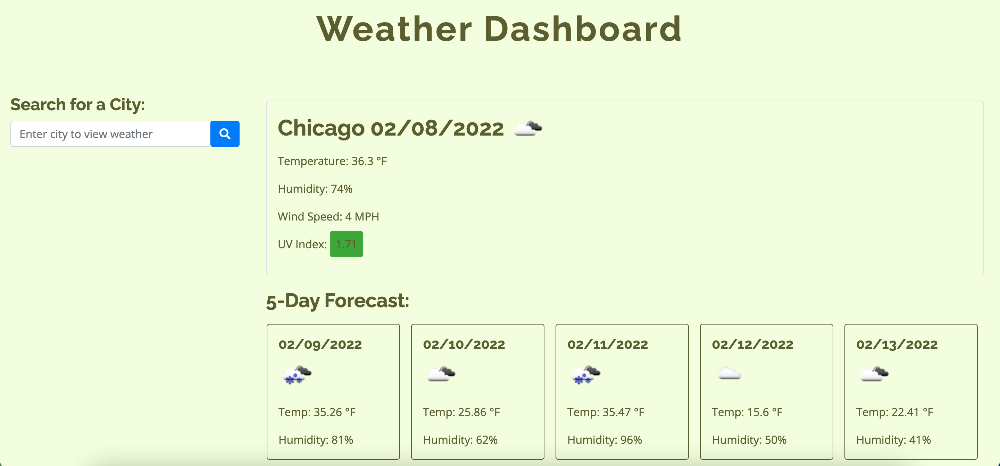

# Weather Dashboard

This is a weather dashboard application that will run in the browser and feature dynamically updated HTML and CSS.

  
## Features

* HTML
* CSS
* Bootstrap
* jQuery
* Moment.js
* Server-Side API - OpenWeather API

## Demo

## Links

* [Github](https://github.com/wl0194)

## License

  Copyright (c) Amy Hwang. All rights reserved.

  
  
